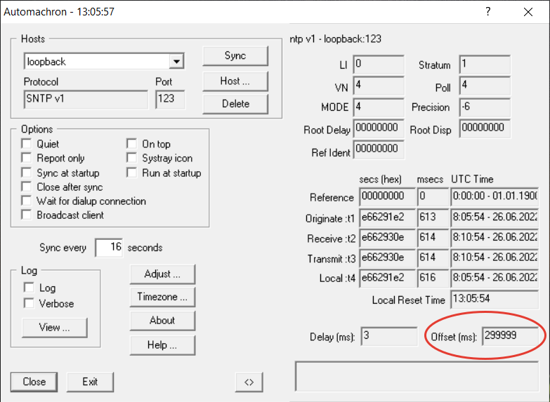

# sntp_server
## Пререквизиты
* SNTP клиент, например Automachron

## Использование
* В файле server.conf указать необходимый offset в секундах
* Запуск startup.py
* Запуск SNTP клиента. Подключение к хосту loopback, порт 123.
* Клиент посылает запросы на сервер, сервер фиксирует:
```
Request from IP: 127.0.0.1	Port: 61862
```
* В клиенте отображается offset (смещение)

